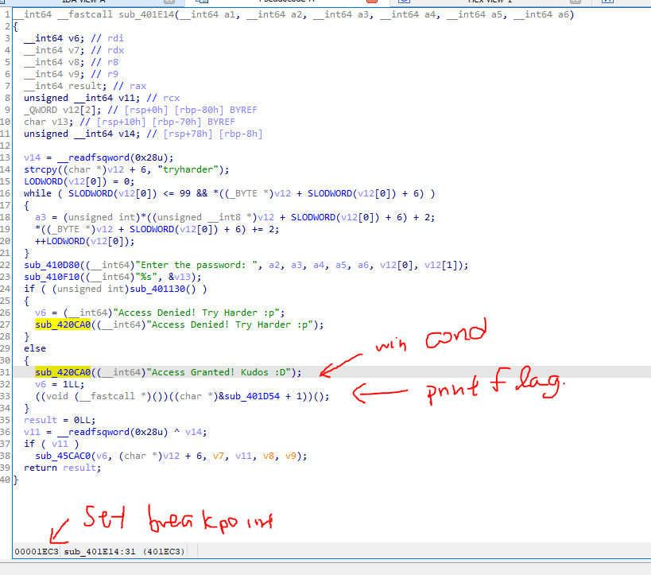
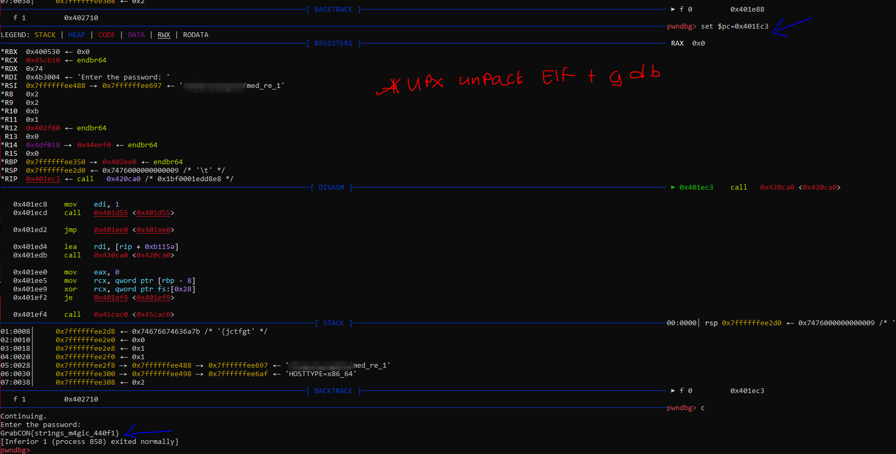

# med_re_1
The binary is packed using UPX, we unpack it using UPX -d med_re_1.

## Dissembling the binary
Next, we inspect the unpacked binary and discovered that the program will display the flag in the win branch 0x00001EC3.

## Getting the flag
We ran the binary in gdb and set our $pc to be at 0x401EC3 and the program displays to us the flag.
