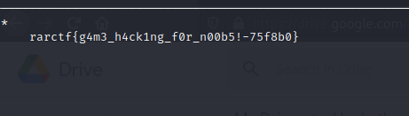

# RaRPG

## Patching the binary
We patch the game binary so that the * moves 2 steps to the right whenever we press right arrow

## Getting the flag
We ran the binary using the following command LD_LIBRARY_PATH=$(pwd) ./client 193.57.159.27 60415,
then we move to the walls and bypass it as the right key will move our * by 2 steps to the right.
